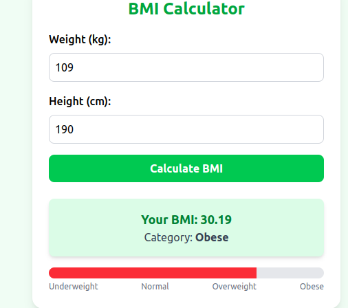

# BMI Calculator

A simple, responsive **Body Mass Index (BMI) Calculator** built with **React**, **Vite**, and **Tailwind CSS v4**.  
It calculates the BMI from weight and height, and displays the result with a **color-coded progress bar** and **category**.

---

##  Preview



##  Features

- **Responsive design** (works on mobile & desktop)
-  **Tailwind CSS v4** styling
- **Animated progress bar** showing BMI range
-  **BMI categories**: Underweight, Normal, Overweight, Obese
-  **Fast build** with Vite
- **Clean code structure** with React Hooks

---

## Tech Stack

- **React** (Frontend framework)
- **Vite** (Build tool)
- **Tailwind CSS v4** (Styling)
- **JavaScript (ES6+)**

---

##  Installation & Setup

1. **Clone the repository**
   ```bash
   git clone https://github.com/Edwin-kipyego/bmi-calculator
   cd bmi-calculator
---Install dependencies


---npm install
---Run the development server


---npm run dev
---Build for production


--- How BMI is Calculated
 --The BMI formula:


BMI = weight (kg) / (height (m)²)
Cut-off points:

BMI Range	    Category	            Color
< 18.5	        Underweight	            Blue
18.5–24.9	    Normal              	Green
25–29.9	        Overweight	            Yellow
≥ 30	        Obese	                Red

 Customization
Change colors in getBMICategory() inside App.jsx

Update Tailwind config in tailwind.config.js

Modify layout directly with Tailwind utility classes


 Author:Edwin Kipkorir Kipyego

Email: koriredwin95@gmail.com

 GitHub Profile: https://github.com/Edwin-kipyego